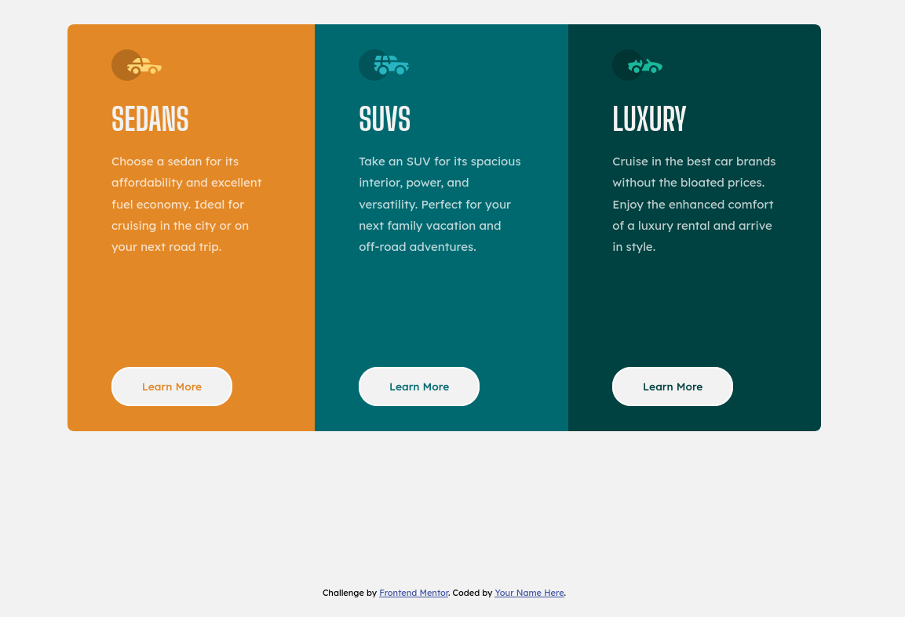

# Frontend Mentor - 3-column preview card component solution

This is a solution to the [3-column preview card component challenge on Frontend Mentor](https://www.frontendmentor.io/challenges/3column-preview-card-component-pH92eAR2-). Frontend Mentor challenges help you improve your coding skills by building realistic projects.

## Table of contents

- [Overview](#overview)
  - [The challenge](#the-challenge)
  - [Screenshot](#screenshot)
  - [Links](#links)
- [My process](#my-process)
  - [Built with](#built-with)
  - [What I learned](#what-i-learned)
  - [Useful resources](#useful-resources)
- [Author](#author)

## Overview

### The challenge

Users should be able to:

- View the optimal layout depending on their device's screen size
- See hover states for interactive elements

### Screenshot



### Links

- Solution URL: [Add solution URL here](https://your-solution-url.com)
- Live Site URL: [Add live site URL here](https://your-live-site-url.com)

## My process

### Built with

- Semantic HTML5 markup
- CSS custom properties
- Flexbox
- CSS Grid
- Mobile-first workflow

### What I learned

I used nth-of-type for the first time in designing. It is really useful to avoid redundant code.

```html
<div class="component">...</div>
```

```css
.component:nth-of-type(2) {
  background: var(--dark-cyan);
}
```

### Useful resources

- [W3Schools](https://www.w3schools.com/) - Great site to refer whenever you are stuck at a particular thing regarding website design.

## Author

- Siddhant Kashyap
- Frontend Mentor - [@asksid27](https://www.frontendmentor.io/profile/asksid27)
- [LinkedIn](https://www.linkedin.com/in/siddhant-kashyap/)
